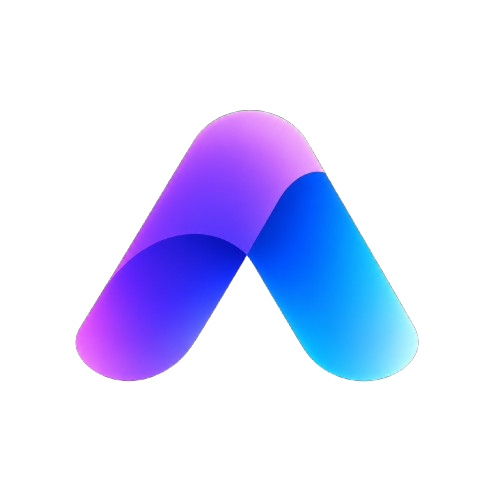
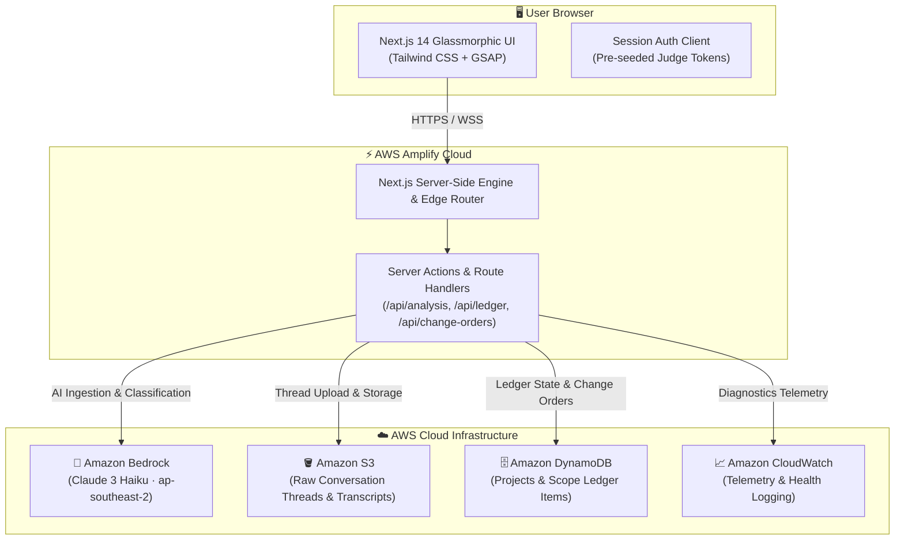

# ALXO — Scope Creep Ledger & Change Order Generator

<div align="center">

<a href="https://main.dhbgp6utbowvg.amplifyapp.com/" target="_blank" rel="noopener noreferrer">
  
</a>

# ALXO
### *“Catch the work hiding between the lines.”*

**Built with precision by Team Arixen**

<br />

[](https://main.dhbgp6utbowvg.amplifyapp.com/)
[](https://aws.amazon.com/bedrock/)
[](https://nextjs.org/)
[](https://www.typescriptlang.org/)
[](https://playwright.dev/)
[](LICENSE)

<br />

[**🚀 Launch Live Demo**](https://main.dhbgp6utbowvg.amplifyapp.com/) • [**🔑 Judge Credentials**](#-judge-fast-track--evaluator-credentials) • [**☁️ AWS Cloud Architecture**](https://main.dhbgp6utbowvg.amplifyapp.com/aws-architecture) • [**🧪 15 Benchmark Test Cases**](#-15-curated-real-world-benchmark-scenarios) • [**👥 Team Arixen**](#-team-arixen--credits--roles)

</div>

---

## ⚡ Judge Fast-Track & Evaluator Credentials

ALXO is fully deployed and production-ready on **AWS Amplify Cloud Infrastructure**.

> **Live Deployment URL**: [**https://main.dhbgp6utbowvg.amplifyapp.com/**](https://main.dhbgp6utbowvg.amplifyapp.com/)

### Pre-Seeded Evaluator Accounts

| Role | Email | Password | Access Rights |
| :--- | :--- | :--- | :--- |
| **Demo Account** *(Recommended)* | `demo@scopecreep.io` | `Demo123!` | Full workspace, ledger analysis, change order export |
| **Provisioned User** | `jordan@designstudio.com` | `Jordan123!` | Standard project workspace access |

> 💡 **Quick Access**: The live Sign-In page includes **1-Click Instant Demo Login** buttons for frictionless evaluation.

### ⏱️ 60-Second Evaluation Walkthrough

1. Open [**https://main.dhbgp6utbowvg.amplifyapp.com/**](https://main.dhbgp6utbowvg.amplifyapp.com/) and click **"Open Demo Workspace"**.
2. Navigate to **"New Scope Analysis"** (`/app/analysis/new`) and click **"⚡ Load Benchmark Demo Thread"** (or choose any scenario from the [15 Test Cases](#-15-curated-real-world-benchmark-scenarios)).
3. Click **"Analyze Scope & Generate Ledger"** to watch **Amazon Bedrock Claude 3** classify messages against the baseline in real time.
4. Review the **Scope Creep Ledger** with confidence scores, line-item costs, and message citations.
5. Click **"Generate Change Order"** to review the deterministic legal document with complete financial impacts and export it as a formal change order.

---

## 🌟 Overview & Problem Statement

### The Problem
Agencies, software consultancies, and freelancers lose **15% to 30% of their billable revenue** to unbilled work. Clients frequently make casual requests across disparate communication channels (Slack threads, WhatsApp chats, email chains) saying: *"Can we quickly add dark mode?"*, *"Could you also connect this to our ERP?"*, or *"Just one more round of revisions."* 

Without an automated audit trail, manual reconciliation is tedious, confrontational, and frequently conceded for free.

### The ALXO Solution
**ALXO** turns messy client conversations into an authoritative, evidence-backed record of additional work. Powered by **Amazon Bedrock Claude 3 Haiku**, ALXO:
1. Ingests raw conversation exports (`.txt`, `.csv`, `.json`).
2. Compares every customer message against the original signed baseline agreement.
3. Automatically categorizes additions, assigns confidence scores, and estimates required hours.
4. Produces a verifiable **Scope Creep Ledger** and generates deterministic, client-ready **Change Orders** with zero manual friction.

---

## ✨ Key Capabilities & Architectural Features

### 1. 🤖 AI Scope Creep Classifier (Amazon Bedrock)
- Powered by **Anthropic Claude 3 Haiku** hosted on **Amazon Bedrock** (`ap-southeast-2`).
- Rigorous prompt engineering with a deterministic confidence threshold (`CONFIDENCE_THRESHOLD = 0.70`).
- Differentiates between clarification of existing scope vs. bona fide scope expansion, extra deliverables, and revision cycle overruns.

### 2. 📊 Authoritative Scope Creep Ledger
- Centralized tracking interface for all scope modifications across active projects.
- Line-item state management: `PENDING`, `APPROVED`, `REJECTED`.
- Complete audit trail linking every single dollar amount directly to the client's original quote and timestamp.

### 3. 📄 Deterministic Change Order Generator
- One-click transformation of verified ledger items into legally binding, audit-ready Change Orders.
- Automatically calculates baseline scope delta, hour additions, blended rates, timeline adjustments, and total price impact.
- Export ready for client digital signing and invoicing.

### 4. 💱 Multi-Currency Global Financial Engine
- Real-time localized financial calculations supporting 7 major global currencies:
  - **USD ($)**, **EUR (€)**, **GBP (£)**, **CAD ($)**, **AUD ($)**, **JPY (¥)**, and **INR (₹)**.
- Formats financial values dynamically with region-accurate decimal precision and symbol placement.

### 5. 🎨 3D Glassmorphic Interface & Dark Mode
- Engineered with modern CSS glassmorphism, responsive data grids, smooth GSAP micro-interactions, and accessible typography.
- Native theme switching with persistent dark-mode and light-mode states.

### 6. 🩺 AWS Cloud Diagnostics Console
- Real-time cloud health telemetry monitoring 6 core AWS services: **AWS Amplify**, **Amazon Bedrock**, **Amazon DynamoDB**, **Amazon S3**, **Amazon Cognito**, and **AWS Lambda**.
- Dedicated interactive architecture diagram page at `/aws-architecture`.

---

## 🧪 15 Curated Real-World Benchmark Scenarios

ALXO includes a complete benchmark suite of **15 industry-specific real-world test scenarios** located in [`apps/web/public/test-cases/`](apps/web/public/test-cases/). Each folder contains baseline contracts, client conversation threads with intentional scope creep, and exact copy-paste form values.

| # | Scenario Title | Industry Domain | Hourly Rate | Test Case Directory |
| :-: | :--- | :--- | :--- | :--- |
| **01** | **E-Commerce Storefront Redesign** | Retail / E-Commerce | `3,500 INR/hr` | [`scenario-1-ecommerce-store`](apps/web/public/test-cases/scenario-1-ecommerce-store/) |
| **02** | **Telehealth MVP Mobile App** | Healthcare / Telemed | `4,000 INR/hr` | [`scenario-2-telehealth-mobile-app`](apps/web/public/test-cases/scenario-2-telehealth-mobile-app/) |
| **03** | **Corporate Branding & Marketing Website** | Creative / Branding | `2,500 INR/hr` | [`scenario-3-branding-marketing-website`](apps/web/public/test-cases/scenario-3-branding-marketing-website/) |
| **04** | **SaaS Backend & Billing API Integration** | Fintech / SaaS | `5,000 INR/hr` | [`scenario-4-saas-backend-api`](apps/web/public/test-cases/scenario-4-saas-backend-api/) |
| **05** | **EdTech Learning Quiz App** | EdTech / E-Learning | `3,000 INR/hr` | [`scenario-5-edtech-quiz-app`](apps/web/public/test-cases/scenario-5-edtech-quiz-app/) |
| **06** | **Healthcare Patient Portal HIPAA Compliance** | Healthcare IT | `4,500 INR/hr` | [`scenario-6-healthcare-portal`](apps/web/public/test-cases/scenario-6-healthcare-portal/) |
| **07** | **Real Estate 3D Virtual Tours** | PropTech / 3D | `3,800 INR/hr` | [`scenario-7-real-estate-3d`](apps/web/public/test-cases/scenario-7-real-estate-3d/) |
| **08** | **AI Chatbot Customer Support System** | Conversational AI / RAG | `5,000 INR/hr` | [`scenario-8-ai-chatbot`](apps/web/public/test-cases/scenario-8-ai-chatbot/) |
| **09** | **Logistics Fleet Management System** | IoT / Fleet Logistics | `4,200 INR/hr` | [`scenario-9-fleet-logistics`](apps/web/public/test-cases/scenario-9-fleet-logistics/) |
| **10** | **Cyber Security Penetration Testing** | Cyber Security | `6,000 INR/hr` | [`scenario-10-cyber-security`](apps/web/public/test-cases/scenario-10-cyber-security/) |
| **11** | **Event Ticketing Web Application** | EventTech / Ticketing | `3,200 INR/hr` | [`scenario-11-event-ticketing`](apps/web/public/test-cases/scenario-11-event-ticketing/) |
| **12** | **HR Payroll Integration Pipeline** | Enterprise HR | `4,800 INR/hr` | [`scenario-12-hr-payroll`](apps/web/public/test-cases/scenario-12-hr-payroll/) |
| **13** | **Gaming Community Dashboard** | Web3 / Gaming | `3,000 INR/hr` | [`scenario-13-gaming-community`](apps/web/public/test-cases/scenario-13-gaming-community/) |
| **14** | **Restaurant Point-of-Sale Ecosystem** | Retail POS | `3,600 INR/hr` | [`scenario-14-restaurant-pos`](apps/web/public/test-cases/scenario-14-restaurant-pos/) |
| **15** | **Financial Analytics & Portfolio Dashboard** | Quantitative Finance | `6,500 INR/hr` | [`scenario-15-financial-analytics`](apps/web/public/test-cases/scenario-15-financial-analytics/) |

---

## 🏗️ System Architecture & AWS Infrastructure



---

## 📁 Repository Structure

```text
Alxo/
├── apps/
│   └── web/                                # Next.js 14 App Router application
│       ├── app/
│       │   ├── (auth)/sign-in/             # One-click judge auth & user sign-in
│       │   ├── (workspace)/app/            # Protected workspace & dashboard
│       │   │   ├── analysis/               # Thread upload & Bedrock analysis flow
│       │   │   ├── ledger/                 # Authoritative Scope Creep Ledger
│       │   │   └── change-orders/          # Deterministic Change Order generator
│       │   ├── admin/diagnostics/          # 6-service AWS cloud health monitor
│       │   └── aws-architecture/          # Interactive live cloud topology showcase
│       └── public/
│           ├── test-cases/                 # 15 complete real-world benchmark suites
│           ├── alxo_logo.png               # ALXO brand icon & UI assets
│           └── arixen_logo.png             # Team Arixen insignia
├── docs/
│   ├── DEMO_CREDENTIALS.md                 # Evaluator sign-in instructions & roles
│   └── aws/                                # AWS deployment guides & build specs
├── sample-data/                            # Reference conversation threads & agreements
├── LICENSE                                 # MIT open-source license
└── package.json                            # Workspace dependencies & root scripts
```

---

## 🛠️ Local Development & Quickstart

### Prerequisites
- Node.js `18.x` or `20.x`
- npm `9.x` or higher

### Installation & Setup

```bash
# 1. Clone the repository
git clone https://github.com/ilakkiyan-j/ScopeCreepDetector.git
cd ScopeCreepDetector

# 2. Install workspace dependencies
npm install

# 3. Start local development server
npm run dev
# The web application will launch at http://localhost:3000
```

### 🧪 Running Automated E2E Tests

ALXO is backed by a Playwright end-to-end test suite with **25/25 passing tests**.

```bash
# Run the automated Playwright test suite
npx playwright test
```

---

## 👥 Team Arixen — Credits & Roles

<div align="center">


### **Engineered by Team Arixen**
*Built for Hackathon Presentation*

</div>

| Member Name | Role & Core Responsibilities | GitHub Profile | Contact Email |
| :--- | :--- | :--- | :--- |
| **Ilakkiyan J** | **Team Lead & Sole Backend Engineer**<br>• System architecture & API specifications<br>• AWS Cloud infrastructure (Amplify, Bedrock, DynamoDB, S3)<br>• Bedrock Claude 3 prompt engineering & classifier engine<br>• Automated 25-scenario Playwright E2E test suite | [@ilakkiyan-j](https://github.com/ilakkiyan-j) | `ilakkiyanj03@gmail.com` |
| **Manikandan E** | **Frontend Developer**<br>• Glassmorphic UI design system & responsive views<br>• Multi-currency dynamic calculation engine<br>• Interactive Scope Creep Ledger state management | [@Manikandan-e56](https://github.com/Manikandan-e56) | `emanigandan58@gmail.com` |
| **Anshika P** | **QA Docs & UI Design Support**<br>• Product functional specifications & user stories<br>• 15 benchmark test scenario documentation<br>• UI layout QA & usability testing | [@anishka-009](https://github.com/anishka-009) | `anshikapal9450@gmail.com` |

---

## 📄 License & Attribution

This project is licensed under the **MIT License** — see the [LICENSE](LICENSE) file for details.

Copyright © 2026 **Team Arixen** (Ilakkiyan J, Manikandan E, Anshika P). All rights reserved.

