# Architecture Decisions Record — Scope Creep Ledger

## Decision 1: Deterministic Cost Arithmetic Over AI Math
- **Date**: 2026-09-13
- **Status**: Accepted
- **Decision**: AI (Amazon Bedrock) is used strictly for message parsing, intent classification, and effort estimation (`estimatedHours`). All financial calculations (`estimatedHours × hourlyRate`, sum of totals) are executed deterministically in application code.
- **Reason**: AI models are non-deterministic and can produce calculation drift or hallucinations. Financial receipts must be mathematically exact and auditable.

## Decision 2: Application-Level Review State for Low-Confidence Items
- **Date**: 2026-09-13
- **Status**: Accepted
- **Decision**: Confidence scores returned by Bedrock below `0.70` set the application verification status to `review_required`. No 5th AI classification category is created.
- **Reason**: Keeps AI classification taxonomy clean (`in-scope`, `new-ask`, `clarification`, `off-topic`) while allowing human-in-the-loop review.

## Decision 3: Fail-Safe Dual Execution Engine (AWS + Mock Fallback)
- **Date**: 2026-09-13
- **Status**: Accepted
- **Decision**: AWS SDK calls to Bedrock, S3, and DynamoDB automatically fall back to deterministic in-memory mock engines when AWS credentials are not configured or when AWS SCP policies restrict access in student lab accounts.
- **Reason**: Ensures 100% reliable execution during live hackathon demonstrations and local development without cloud dependency failures.

## Decision 4: Amazon Cognito for Authentication & Authorization
- **Date**: 2026-09-13
- **Status**: Accepted
- **Decision**: Amazon Cognito will handle user identity, JWT tokens, and user/admin role claims. Unrestricted public registration will be disabled in favor of admin-invitation / request access flows for MVP.
- **Reason**: Provides secure, production-grade identity management integrated directly into the AWS stack.

## Decision 5: Monorepo Workspaces Layout
- **Date**: 2026-09-13
- **Status**: Accepted
- **Decision**: Maintained npm workspace structure: `apps/web` (Next.js 14 frontend), `services/*` (backend microservices), `shared/*` (TypeScript contracts).
- **Reason**: Clear separation of concerns while keeping shared domain types synchronized across frontend and backend.

## Decision 6: Strict Public / User / Admin Route Separation
- **Date**: 2026-09-13
- **Status**: Accepted
- **Decision**: Routes are strictly namespaced: public (`/`, `/sign-in`, `/request-access`), user workspace (`/app/*`), admin console (`/admin/*`). User routes must never resolve to admin routes and vice-versa. Direct URL access and role redirects are tested, not just button navigation.
- **Reason**: The previous flat structure (`/dashboard`, `/admin`, `/profile`) produced dead anchors, admin dead-ends, and a collapse of the whole workspace into one page.

## Decision 7: Demo = Authenticated Demo User (Option A)
- **Date**: 2026-09-13
- **Status**: Accepted
- **Decision**: The demo workspace is a real, authenticated demo **USER** account (`demo@scopecreep.io`, role USER). "Open Demo Workspace" signs the visitor in as that account and lands in `/app/dashboard` with a persistent "Demo Mode" banner. The demo experience must NEVER route to `/admin`.
- **Reason**: Showcases the real product without faking authorization state or accidentally exposing the admin interface.

## Decision 8: Clean Mock Auth for MVP (Cognito Later)
- **Date**: 2026-09-13
- **Status**: Accepted
- **Decision**: The MVP keeps a cleaned-up mock auth layer: visitors are unauthenticated by default (no silent auto-login), `/sign-in` is a real gate, the demo account is explicitly a demo session (no fabricated JWT claims), and `ProtectedRoute`/route guards are presentation-level only. Amazon Cognito remains the documented production path (see `AWS_STATUS.md`) and is NOT implemented in this redesign.
- **Reason**: Real Cognito SDK + JWT verification + backend auth middleware is a separate workstream requiring AWS resource setup; the hackathon needs an honest, non-misleading auth experience now.

## Decision 9: Semantic Theme Tokens Only (No Random `dark:` Colors)
- **Date**: 2026-09-13
- **Status**: Accepted
- **Decision**: All components consume a shared semantic token system (`background`, `foreground`, `card`, `card-foreground`, `muted`, `muted-foreground`, `border`, `primary`, `secondary`, `accent`, `success`, `warning`, `danger`, `info`, `input`, `ring`, `popover`). Light and dark modes use the same component system; hardcoded hex colors and mixed `dark:bg-*` values must not appear in component code. Tailwind must be configured with `darkMode: 'class'`.
- **Reason**: The prior theme was "split-brain" (Tailwind `dark:` responded to OS media queries while the app toggle only changed CSS variables), producing contradictory mixed styling and dark-only islands.

## Decision 10: User Default Currency + Project Currency (No FX)
- **Date**: 2026-09-13
- **Status**: Accepted
- **Decision**: Currency is a per-user preference (`defaultCurrency`) and also a per-project property. New projects inherit the user's default currency but can be changed per project. A currency code identifies the currency only — NO automatic FX conversion. Cross-currency admin aggregation is shown grouped by currency.
- **Reason**: Freelancers work with international clients; assuming USD was wrong. Converting without real FX rates would fabricate financial truth.

## Decision 11: Attachment Staging Before Upload
- **Date**: 2026-09-13
- **Status**: Accepted
- **Decision**: Multi-file selection is staged in browser state (name/size) only. Users review, remove wrong files, add more, and confirm before any bytes are uploaded/analyzed. The upload button reflects the remaining file count.
- **Reason**: The prior dropzone uploaded/analyzed immediately; accidental or wrong files created wasted analyses and confusion.

## Decision 12: Architectural Alternatives & Pipeline Decomposition
- **Date**: 2026-09-13
- **Status**: Accepted
- **Decision**: Reject pure rule-based NLP entity extractors and monolithic single-prompt LLM architectures in favor of a modular hybrid pipeline: Ingestion (S3) -> Session Coalescing Parser -> Bedrock Claude Haiku 4.5 Schema Classifier -> Confidence Gating (< 0.70 Human Review) -> 100% Deterministic TypeScript Financial Engine & DynamoDB.
- **Architectural Comparison**:

| Architecture | Mechanism | Why Considered | Critical Failure Mode in Production | Verdict |
|---|---|---|---|---|
| **Option 1: Rule-Based NLP & Entity Extraction** | POS tagging + verb-noun extraction (spaCy) matched against SOW checklist | Zero API cost, < 50ms latency, runs locally | **Fails on conversational hedging:** Real clients write polite indirect requests (*"not sure if in scope, but could we maybe explore parallax..."*), which classical NLP parsers miss completely. | **REJECTED** |
| **Option 2: Monolithic End-to-End LLM Prompt** | Single massive prompt taking 150+ messages + SOW to output final invoice | All-in-one generation, minimal pipeline code | **Arithmetic hallucinations & context overflow:** LLMs predict tokens and drift on rate multiplication (e.g. `5.5 hrs * $60 = $390` instead of `$330`); crashes on long chat histories without human verification. | **REJECTED** |
| **Winning: Alxo Modular Hybrid Pipeline** | S3 Archival -> Chronological Parser AST -> Claude Haiku Schema Extraction -> Confidence Gating (< 0.70) -> Deterministic TypeScript Math | Combines semantic understanding with 100% exact math & human-in-the-loop review | Zero calculation drift, sub-second execution, transparent auditability, minimal token cost. | **ACCEPTED** |

```mermaid
graph TD
    subgraph Alt1["❌ Rejected Option 1: Rule-Based NLP & Entity Extraction"]
        A1_Input["Raw Chat Messages"] --> A1_POS["NLP POS Tagging & Verb-Noun Parsing"]
        A1_POS --> A1_Match["Heuristic SOW Deliverable Matcher"]
        A1_Match --> A1_Fail["⚠️ Failure: Blind to Conversational Nuance
Misses polite hedging ('Could we maybe explore...')
& triggers false positives on casual chat."]
    end

    subgraph Alt2["❌ Rejected Option 2: Monolithic End-to-End LLM Prompt"]
        A2_Input["Full 150+ Message Chat + SOW"] --> A2_Prompt["Single Giant LLM Prompt
(Classify + Calculate + Draft Email)"]
        A2_Prompt --> A2_Fail["⚠️ Failure: Financial Hallucination & Token Limits
Multiplication errors on hourly rates,
context overflow, & no human review gate."]
    end

    subgraph Winning["✅ Winning Architecture: Alxo Modular Hybrid Pipeline"]
        W_Input["Raw Ingestion (Amazon S3)"] --> W_Parse["Chronological Session Parser AST"]
        W_Parse --> W_Bedrock["Amazon Bedrock Claude Haiku (Schema Extraction)"]
        W_Bedrock --> W_Gate["Confidence Gating (< 0.70 Review Queue)"]
        W_Gate --> W_Math["100% Deterministic TypeScript Financial Engine"]
        W_Math --> W_Store["Amazon DynamoDB & Verified Change Orders"]
    end
```

